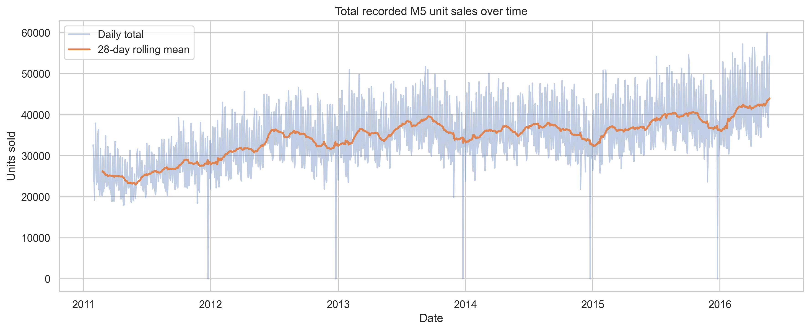
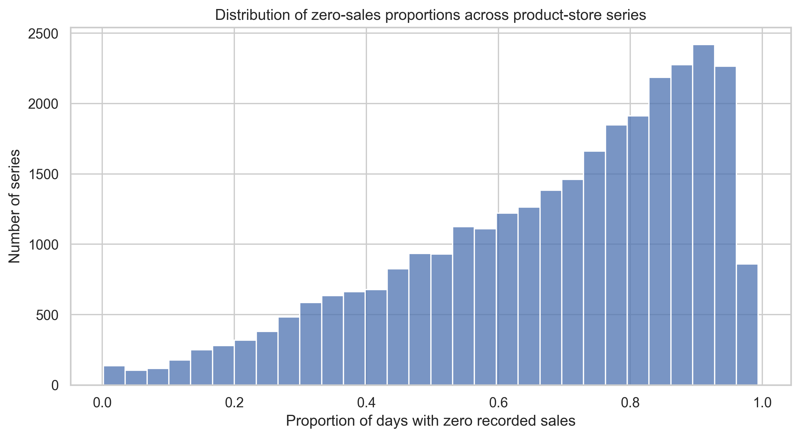

# Initial Data Audit and EDA Summary

## Status

This is an initial report. It covers the first data checks and two dataset-level charts. It is not the final EDA report because individual product-store series have not been selected or studied yet.

## Purpose

The purpose of this work was to confirm that the M5 files are complete and suitable for the next stage of the project. We also looked at total sales over time and the amount of zero-sales days across product-store series.

The checks and charts were created in `notebooks/01_data_audit_and_eda.ipynb`.

## Data used

We checked the five M5 competition files:

- `calendar.csv`
- `sales_train_evaluation.csv`
- `sales_train_validation.csv`
- `sample_submission.csv`
- `sell_prices.csv`

The files are not stored in Git. The project download script gets them from Kaggle and verifies their checksums.

## Main data checks

| Check | Result | Meaning |
|---|---:|---|
| Product-store series | 30,490 | The data contain one daily sales series for each item-store combination. |
| Unique products | 3,049 | The products appear across the 10 stores. |
| Evaluation history | 1,941 days | The evaluation sales file covers `d_1` through `d_1941`. |
| Duplicate series IDs | 0 | Each product-store series appears once. |
| Negative sales values | 0 | No structurally invalid negative unit sales were found. |
| Zero-sales observations | About 68% | Many product-store series have sparse or intermittent recorded sales. |
| Calendar problems | 0 | The dates are unique, complete, and consecutive. |
| Duplicate price keys | 0 | Each store-item-week price key appears once. |
| Missing or non-positive stored prices | 0 | Every price record that exists has a valid positive value. |

These results show that the files have a valid basic structure. They do not prove that every sales row will have a matching price after the data are changed to long format. We will test the final join in the next stage.

## Initial figures

### Total recorded sales over time

The daily total changes across the full history. The 28-day rolling average also shows that the general sales level changes over time. This means dates should remain in order when we train and test forecasting models. A random train-test split would mix earlier and later sales periods and could give misleading results.

The sharp low points need more investigation. We should check calendar events and store-level patterns before giving them a business explanation.

### Zero-sales variation across product-store series

The percentage of zero-sales days is very different across product-store series. Some series sell on most days, while many series have zero recorded sales on a large share of days. This supports selecting different types of series for the project instead of treating every product in the same way.

This result also supports the main project idea. One fixed safety-stock buffer may not work equally well for products with very different sales patterns.

## Important limitation

A zero in the M5 data means that no sale was recorded. It does not prove that customer demand was zero. The data do not show whether an item was out of stock or whether a customer wanted to buy an unavailable item. For this reason, later stockouts and inventory levels will be simulation results based on clearly stated assumptions.

## Next steps

1. Protect the final chronological test period before selecting series.
2. Change the sales data from wide format to long format.
3. Join dates and calendar information without changing the sales row count.
4. Join weekly prices and measure unmatched records.
5. Calculate series-level sales measures using pre-test data only.
6. Select a clear sample of stable, seasonal, intermittent, and highly variable series.
7. Complete the detailed EDA for the selected series.
